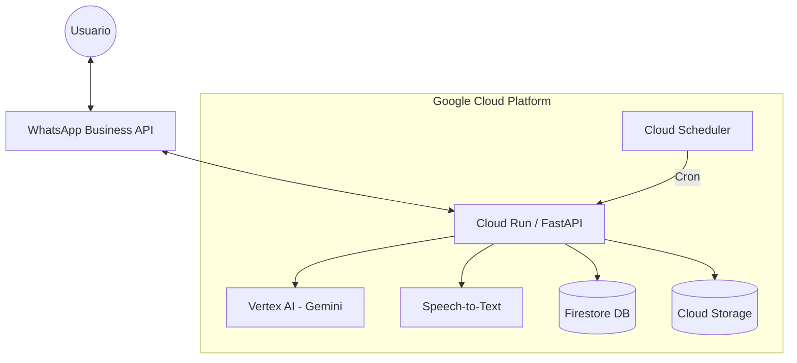

# Asistente de Reservas por WhatsApp - CIPRES Ecolodge

Un chatbot inteligente y **multimodal** para gestionar reservas de cabañas, enviar promociones y recuperar ventas, potenciado por **Gemini AI**, **Imagen 3** y **Speech-to-Text**.

---

## 📋 Capacidades Principales

### 🧠 Inteligencia Artificial
- **Conversación Natural:** Memoria de contexto y personalidad adaptable (amable, profesional, entusiasta).
- **Multi-idioma Automático:** Detecta y responde en **Español, Inglés o Portugués** según el usuario.
- **Venta Consultiva:** Hace preguntas proactivas (niños, mascotas, motivo de viaje) para recomendar la cabaña ideal.

### 🔊 Multimodalidad
- **Transcripción de Audio:** Recibe audios de WhatsApp, los transcribe con **Google Speech-to-Text** y responde como texto.
- **Generación de Promociones:** Crea posts de marketing (texto + imagen) usando **Gemini 2.0 Flash (Nano Banana Pro)**.

### ⚙️ Automatización
- **Recuperación de Carritos:** Cron job que detecta conversaciones abandonadas con intención de compra y envía seguimiento automático.
- **Gestión de Reservas:** Consulta disponibilidad real y crea pre-reservas en el sistema.

---

## 🏗️ Arquitectura del Sistema



---

## 📁 Estructura del Proyecto

```
chatbot-reservas/
├── app/
│   ├── api/
│   │   ├── generate_promo.py     # Endpoint: Generación de promociones con IA
│   │   ├── promotions.py         # Endpoint: Envío masivo de promociones
│   │   └── cron.py               # Endpoint: Tareas programadas (seguimiento)
│   │
│   ├── agent/
│   │   ├── core.py               # Cerebro del agente (Gemini Loop)
│   │   ├── prompts.py            # Prompt Engineering avanzado (Google Best Practices)
│   │   └── tools.py              # Herramientas (Disponibilidad, Fotos, Reserva)
│   │
│   ├── services/
│   │   ├── speech.py             # Transcripción de Audio (Speech-to-Text)
│   │   ├── firebase.py           # Base de datos y configuración dinámica
│   │   ├── whatsapp.py           # Cliente API de Meta

│   │
│   ├── config.py                 # Configuración centralizada
│   └── main.py                   # Server FastAPI y Webhook
```

---

## 🚀 Despliegue en Google Cloud

### 1. Requisitos Previos
- Habilitar APIs: Vertex AI, Cloud Run, Cloud Build, Speech-to-Text.
- Crear Bucket en Cloud Storage (`[PROJECT_ID].firebasestorage.app`).
- Configurar cuenta de WhatsApp Business.

### 2. Variables de Entorno
Configurar en `config.py` o Cloud Run:
- `GCP_PROJECT_ID`, `GCP_LOCATION`
- `META_TOKEN`, `PHONE_NUMBER_ID`, `VERIFY_TOKEN`
- `HISTORY_LIMIT` (Recomendado: 30)

### 3. Comandos de Despliegue

**Backend:**
```bash
gcloud builds submit --tag gcr.io/[PROJECT_ID]/reservas-whatsapp
gcloud run deploy reservas-whatsapp --image gcr.io/[PROJECT_ID]/reservas-whatsapp --platform managed --region us-central1 --allow-unauthenticated
```

**Cron Job (Seguimiento de abandonos):**
```bash
# Ejecutar cada 30 minutos
gcloud scheduler jobs create http follow-up-abandoned \
    --schedule="*/30 * * * *" \
    --uri="https://[TU-URL-CLOUDRUN]/api/cron/follow-up-abandoned" \
    --http-method=POST \
    --location=us-central1
```

---

## 🛠️ Endpoints Clave

| Método | Endpoint | Descripción |
|--------|----------|-------------|
| `POST` | `/webhook` | Recibe mensajes (texto/audio) de WhatsApp |
| `POST` | `/api/generate-promotion` | Crea marketing content con IA (Texto + Imagen) |
| `POST` | `/api/send-promotion` | Envía mensaje masivo a lista de teléfonos |
| `POST` | `/api/cron/follow-up-abandoned` | Trigger para recuperar ventas perdidas |

---

## 🔮 Funcionalidades Detalladas

### Generación de Imágenes (Nano Banana Pro)
El sistema usa **Gemini 2.0 Flash (Nano Banana Pro)** para generar imágenes promocionales photorealistas, enfocándose en experiencias y emociones (familias felices, parejas) en lugar de arquitectura vacía.

### Transcripción de Audio
Soporta audio mono (WhatsApp OGG/Opus). Detecta automáticamente direcciones de correo dictadas (ej: "juan arroba gmail punto com" → `juan@gmail.com`).

### Configuración Dinámica
El comportamiento del bot (tono, emojis, mensajes base) se puede cambiar en tiempo real editando la colección `bot_settings` en Firestore, sin redeploy.
