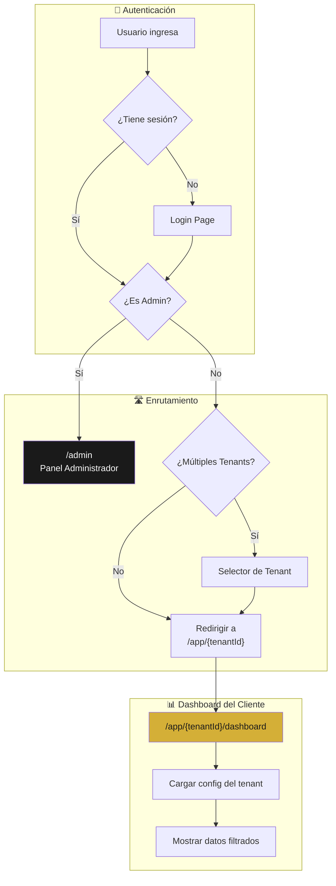
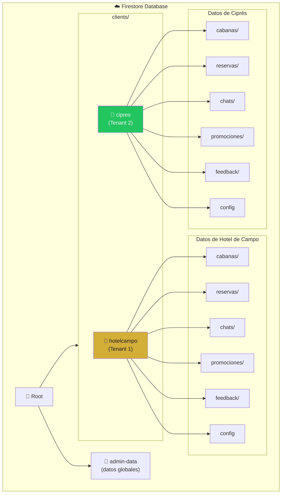
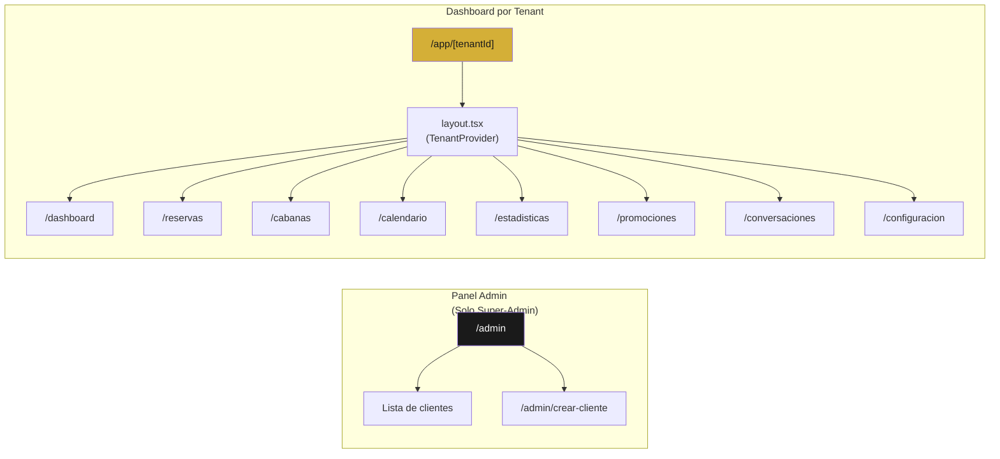
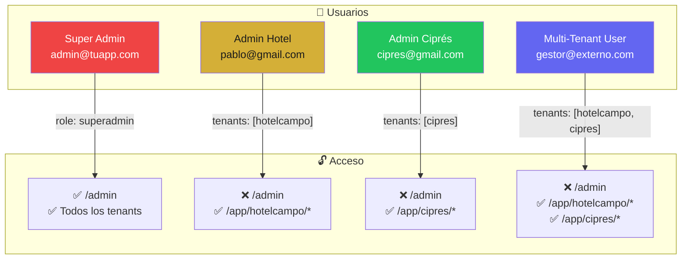
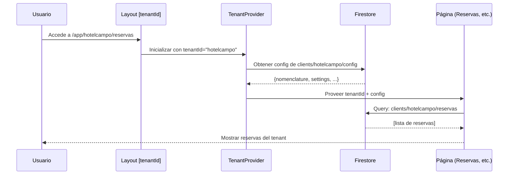

# Arquitectura Multi-Tenant para Dashboard

## Resumen
Implementación de multi-tenancy usando **base de datos compartida con Tenant ID** (Opción 1) y **rutas dinámicas con Tenant ID** (Opción 3).

---

## 🔄 Flujo General de Usuario



---

## 📁 Estructura de Base de Datos (Firestore)



### Ejemplo de Paths:
| Antes (Sin Multi-Tenant) | Después (Con Multi-Tenant) |
|--------------------------|---------------------------|
| `reservas/` | `clients/{tenantId}/reservas/` |
| `cabanas/` | `clients/{tenantId}/cabanas/` |
| `chats/` | `clients/{tenantId}/chats/` |
| `config` | `clients/{tenantId}/config` |

---

## 🛣️ Estructura de Rutas (Next.js App Router)



### Estructura de Carpetas:
```
src/app/
├── admin/                    # Panel Super-Admin
│   └── page.tsx
├── app/
│   └── [tenantId]/           # Dynamic route por tenant
│       ├── layout.tsx        # TenantProvider wrapper
│       ├── page.tsx          # Dashboard
│       ├── reservas/
│       │   └── page.tsx
│       ├── cabanas/
│       │   └── page.tsx
│       ├── calendario/
│       │   └── page.tsx
│       └── ...
└── login/
    └── page.tsx
```

---

## 🔐 Modelo de Usuarios y Permisos



### Estructura de Usuario en Firestore:
```json
{
  "uid": "abc123",
  "email": "pablo@gmail.com",
  "role": "tenant_admin",
  "tenants": [
    {
      "id": "hotelcampo",
      "name": "Hotel de Campo",
      "role": "admin",
      "permissions": ["read", "write", "delete"]
    }
  ]
}
```

---

## 🔄 Flujo de Datos con TenantContext



---

## 🛡️ Seguridad con Firestore Rules

```javascript
rules_version = '2';
service cloud.firestore {
  match /databases/{database}/documents {
    
    // Función helper para verificar acceso al tenant
    function hasAccessToTenant(tenantId) {
      return request.auth != null && (
        request.auth.token.role == 'superadmin' ||
        tenantId in request.auth.token.tenants
      );
    }
    
    // Datos de cada tenant - solo accesibles por sus usuarios
    match /clients/{tenantId}/{document=**} {
      allow read, write: if hasAccessToTenant(tenantId);
    }
    
    // Panel admin - solo super-admins
    match /admin-data/{document=**} {
      allow read, write: if request.auth.token.role == 'superadmin';
    }
  }
}
```

---

## 📊 Resumen de Cambios Necesarios

| Componente | Estado Actual | Cambio Requerido |
|------------|---------------|------------------|
| **Rutas** | `/reservas`, `/cabanas` | `/app/[tenantId]/reservas` |
| **Queries** | `collection(db, 'reservas')` | `collection(db, 'clients/${tenantId}/reservas')` |
| **Context** | `ConfigContext` | Agregar `TenantContext` con `tenantId` |
| **Auth** | Simple login | Agregar `tenants[]` a usuario |
| **Sidebar** | Links fijos | Links dinámicos con `tenantId` |

---

## ⏱️ Estimación de Implementación

| Fase | Tarea | Tiempo |
|------|-------|--------|
| 1 | Restructurar Firestore (migrar datos) | 2-3 horas |
| 2 | Crear rutas dinámicas `/app/[tenantId]/` | 3-4 horas |
| 3 | Implementar `TenantContext` | 2 horas |
| 4 | Actualizar todas las queries con tenantId | 3-4 horas |
| 5 | Actualizar Sidebar y navegación | 1-2 horas |
| 6 | Firestore Security Rules | 1 hora |
| 7 | Testing y ajustes | 2-3 horas |
| **Total** | | **~15-20 horas** |
